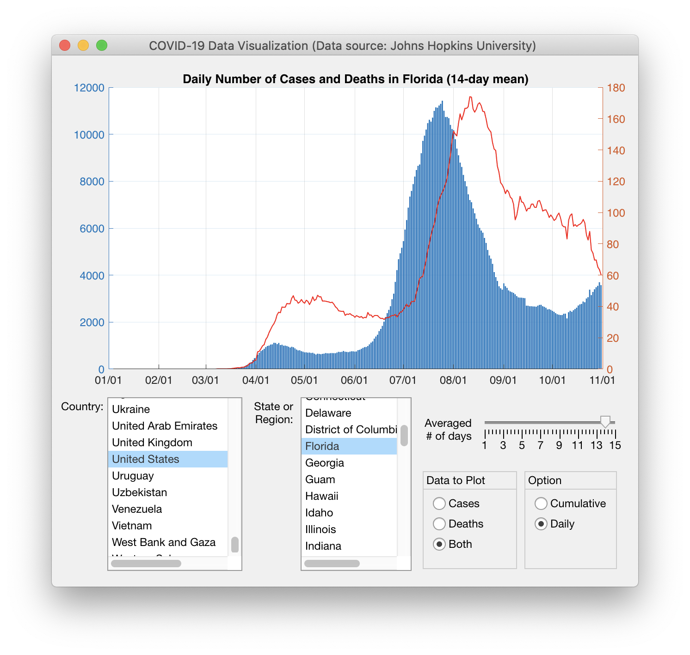
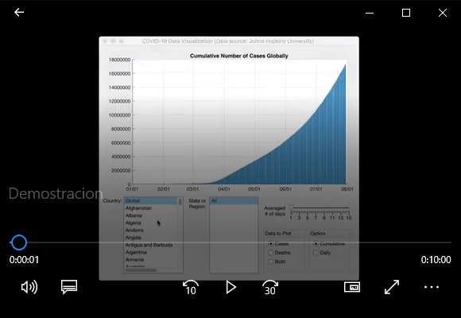
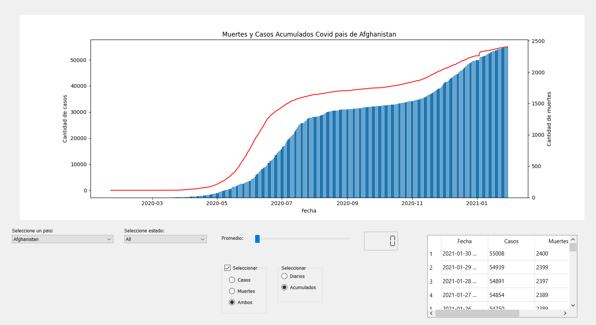

# Proyecto Final - PYTHON INTERMEDIO "A"

## Objetivos de aprendizaje
- Aplicar nuevas habilidades a un problema del mundo real
- Sintetizar las técnicas aprendidas

## Herramientas
- git
- github (utilizar gitignore para proyectos python)
- python 3 
- librerías (pandas, matplotlib, numpy, sympy, etc.)
- **pyqt5** * 
- **QT Designer** *
- gitter (chat privado para consultas puntuales, chat grupal para consultas sobre uso de git o consultas generales)

>En los contenidos de la semana 5 del plan de estudios se detallan los pasos para instalar pyqt5 y QT Designer 

## Flujo de Trabajo
1. Clona este repositorio en tu máquina local    
2. Edite los archivos que sean necesarios y complete todas las tareas semanales que se señalan en los entregables.
3. Confirme sus cambios y envíelos a github. 

## Entregables

- **Semana 2 (22 dic.):**  Lectura de datos, visualización gráficas
- **Semana 4 (12 ene.):**   Implementación de métodos para widgets 1, 2, 3 y diseño de prototipo en QT Designer
  - Revisar [vídeo](https://www.youtube.com/watch?v=865Q41omqPk&list=PLwkJQeEWueTuGaSk2ofa1K5JAuLgtV6x_&index=23&ab_channel=cctmexico) de ejemplo
- **Semana 6 (26 ene.):** Implementación de widgets 1, 2, 3, 4
- **Semana 8 (9 feb.):**  Implementación de widget 5, 6, pruebas, documentación, defensa de proyecto.

## Organización de carpetas
- img/
- data/
- src/
- gui/
- main.py

## Instrucciones

El objetivo del proyecto final es sintetizar una serie de conceptos nuevos aprendidos en este curso y aplicarlos en la práctica para resolver un problema del mundo real. Específicamente, deberá utilizar técnicas de programación orientada a objetos y crear una aplicación con una interfaz gráfica de usuario moderna para procesar y visualizar datos relacionados con COVID-19.

### Criterios de revisión

La especificación del problema describe una lista de requisitos sobre la funcionalidad y el enfoque requerido. La calificación se basa en cuántos de los requisitos se satisfacen con la solución dada.

### Instrucciones de asignación paso a paso

El objetivo del proyecto final es crear un programa en PYTHON que procese y visualice los datos de la pandemia de COVID-19. Los datos (obtenidos del Centro de recursos sobre coronavirus de la Universidad Johns Hopkins) están disponibles en el archivo [.csv](http://purl.org/pythonintermedio/proyectofinal/data) adjunto, usted puede utilizar una fuente de datos más actualizado e inclusive desde algún servicio que brinde los datos en formato json. 

El archivo que se proporciona contiene los recuentos globales de casos y muertes por país, estado y fecha. Específicamente, la primera fila de la matriz de celdas especifica lo que contiene cada columna: país y estado seguidos de una serie de fechas que comienzan en "22/1/20", es decir, 22 de enero de 2020. No codifique la fecha de finalización, ya que anticipamos actualizar los datos regularmente a medida que avanza el tiempo. Cada celda de datos para un país y una fecha determinada contiene un vector de dos elementos: el primer elemento es el recuento acumulativo de casos, mientras que el segundo es el número acumulativo de muertes.

Su programa debe cargar estos datos en un dataframe y filtrar la información en función de lo que solicite el usuario. 

La interfaz gráfica de usuario de su programa debe contener varios widgets:
1. Un área única donde grafica los datos. El título de la gráfica debe ser informativo mostrando qué país / estado se muestra y también indicando las opciones relevantes que se utilizaron para generar la gráfica. (Ver más abajo). Las etiquetas x deben ser fechas. Debe implementar diferentes escalas y para los dos gráficos de la izquierda y la derecha, como se muestra a continuación.
2. Un cuadro de lista que muestra todos los países disponibles. El primer elemento debe llamarse "Global" y seleccionarlo debe trazar los datos globales. Esto no está contenido en la base de datos, por lo que deberá calcularlo.
3. Otro cuadro de lista que muestra todos los estados del país seleccionado actualmente. La primera opción debería ser "Todos". Como la mayoría de los países no tienen estados, regiones, territorios o provincias asociados con ellos en la base de datos, esta será la única opción para ellos. Al seleccionarlo, se deberían mostrar los datos del propio país. Hay dos tipos de países con estados en la base de datos. Australia, Canadá, China y Estados Unidos tienen todos sus estados, provincias, etc. enumerados. Otros países como el Reino Unido, los Países Bajos o Dinamarca no están subdivididos, pero tienen una serie de territorios de ultramar enumerados. Por ejemplo, el Reino Unido no se divide en Inglaterra, Escocia, Gales e Irlanda del Norte, pero tiene territorios adicionales, como las Islas Malvinas, en la lista.
4. Un widget para seleccionar el número de días utilizados para calcular un promedio móvil de los datos (de 1 a 15). Asegúrese de que la selección sea un número entero. Seleccionar 1 significa que no hay promedios. Tenga en cuenta que el promedio móvil debe utilizar los últimos N-1 días y el día actual, donde N es el número de días seleccionados.
5. Un widget para seleccionar qué trazar: casos, muertes o ambos.
6. Un widget para seleccionar si se trazan datos acumulados o números diarios. La base de datos contiene datos acumulativos. Debe calcular los datos diarios teniendo en cuenta los posibles errores de datos. Específicamente, asegúrese de no trazar nunca valores negativos.

Siempre que cambie alguno de los widgets de la GUI, el gráfico y su título deben actualizarse de inmediato.

A continuación se muestra una captura de pantalla de una implementación de ejemplo. 

Demostración de funcionamiento

  

Tenga en cuenta que tiene flexibilidad para resolver el problema. Solo asegúrese de cumplir con los requisitos anteriores. Puede agregar funciones adicionales si lo desea. Por ejemplo, tener un cuadro de búsqueda, para que el usuario no tenga que desplazarse y buscar países manualmente en el cuadro de lista, sería una buena característica. También sería útil cambiar el rango de fechas para trazar.
covid_data.csv

Nota: el archivo csv se ha actualizado para incluir datos hasta el 31 de octubre de 2020.

[covid_data.csv](http://purl.org/pythonintermedio/proyectofinal/data)

Nota: el archivo mat se ha actualizado para incluir datos hasta el 31 de octubre de 2020.

### Cómo enviar proyecto final:

El repositorio debe actualizarse de forma continua, creando las ramas y comits necesarios. Su proyecto debe contener todos los archivos PYTHON necesarios para ejecutar su programa . Normalmente, tendría tres archivos: el archivo de la aplicación (.py), el archivo .ui con el diseño de la interfaz y los datos datos de prueba. Esto último es útil para asegurarse de que se revise su programa con los datos con los que lo probó, ya que se planea actualizar el archivo de datos regularmente a medida que avanza el tiempo. 

### Solución del proyecto

Demostración de la solución

